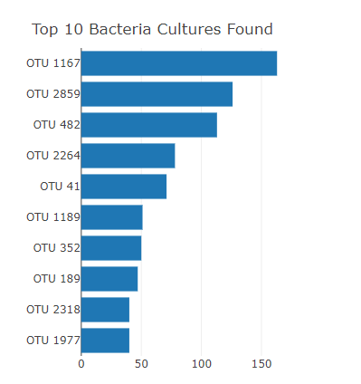
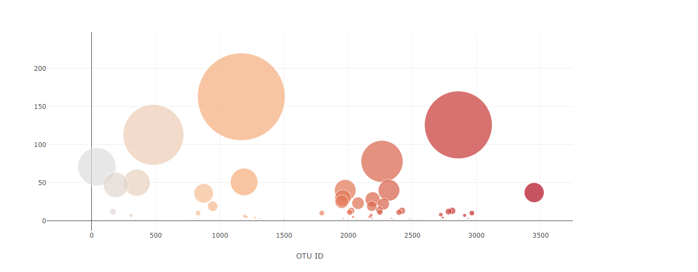
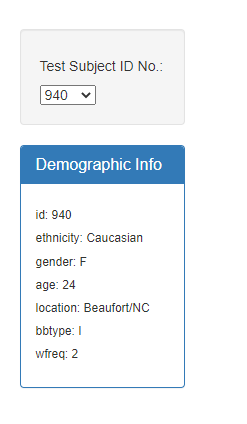

# Plot.ly Homework - Belly Button Biodiversity

In this assignment, I built an interactive dashboard to explore the [Belly Button Biodiversity dataset](http://robdunnlab.com/projects/belly-button-biodiversity/), which catalogs the microbes that colonize human navels.

The dataset reveals that a small handful of microbial species (also called operational taxonomic units, or OTUs, in the study) were present in more than 70% of people, while the rest were relatively rare.

## Step 1: Plotly

1. Used the D3 library to read in `samples.json`.

2. Created a horizontal bar chart with a dropdown menu to display the top 10 OTUs found in that individual.

* Use `sample_values` as the values for the bar chart.

* Use `otu_ids` as the labels for the bar chart.

* Use `otu_labels` as the hovertext for the chart.

  

3. Created a bubble chart that displays each sample.

* Used `otu_ids` for the x values.

* Used `sample_values` for the y values.

* Used `sample_values` for the marker size.

* Used `otu_ids` for the marker colors.

* Used `otu_labels` for the text values.

4. Displaying the sample metadata, i.e., an individual's demographic information.

5. Displaying each key-value pair from the metadata JSON object somewhere on the page.

6. Updated all of the plots any time that a new sample is selected.

## Deployment

* Deployed my app to a free static page hosting service, such as GitHub Pages. Submit the links to your deployment and your GitHub repo.

